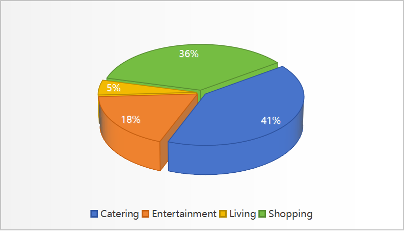

<!-- PROJECT LOGO -->
<p align="center">
  <h1 align="center">🌋 Software Engininging</h1>
  <p align="center">
    <a href="http://39.108.48.32/mipl/news/news.php?id=EGgengzijun"><strong>Zijun Geng</strong></a>
    ·
    <a href="https://github.com/monet-uta"><strong>Ye Wang</strong></a>
    ·
    <a href="https://github.com/Wenrui2"><strong>Wenrui Bai</strong></a>
    ·
    <a href="https://github.com/zhoujiayi2022213672"><strong>Jiayi Zhou</strong></a>
    ·
    <a href="https://github.com/HeYihui-Amos"><strong>Yihui He</strong></a>
    ·
    <a href="https://github.com/Gh0Zy"><strong>Yuyuan Zhao</strong></a>
    ·
    <a href="https://github.com/yymm1234"><strong>Wenxuan Zeng</strong></a>
  </p>
  <h2 align="center">EBU6304 Software Engineering</h2>
<div align="center"></div>
<p align="center">
  <p>
  Our team has crafted an <strong>AI - empowered Personal Finance Manager</strong>. It's a comprehensive desktop financial management tool for individuals. With a multimodal AI engine and a China - centred financial ecosystem, it offers precise, flexible, and secure financial lifecycle management. Suitable for all, from salaried workers and seniors to investors, it enhances financial literacy and budgeting skills. Beyond daily accounting and budget control, its core strengths in smart forecasting, risk alerts, and tax adaptation redefine financial management in the AI era. 
  </p>
  <a href="">
    
  </a>
<br>

## 📣 News
- [03/15/2025] 🔥 We release our datasets structure!
- [03/15/2025] Our prototype is comming soon. Stay tuned! 

## 📋 Datasets

We release our datasets here()！We collected consumption bills from 2024.01 to 2025.03. And divide all the data into 5 datasets on a quarterly basis.
An example of our data sample is below:

|Transaction time	|Type	| Amount (RMB)|
|---------------|----------|---------|
|2024/3/1 18:11 | Catering	 | ￥14.00 |

We divide consumption into 4 categories, which are: <strong>Catering</strong>、<strong>Entertainment</strong>、<strong>Shopping</strong>、<strong>Living</strong>. The following pie charts describes the number of consumption types in each dataset.

 
 
 
 


## 🤝 Student Information

| Name          | QMUL Student ID | BUPT Student ID |
|---------------|----------|---------|
| <a href="http://39.108.48.32/mipl/news/news.php?id=EGgengzijun"><strong>Zijun Geng</strong></a>| 221170571 | 2022213671 |
| <a href="https://github.com/monet-uta"><strong>Ye Wang</strong></a>|   |     |
| <a href="https://github.com/Wenrui2"><strong>Wenrui Bai</strong></a>| 221170504 | 2022213667 |
| <a href="https://github.com/zhoujiayi2022213672"><strong>Jiayi Zhou</strong></a>| 221170630 | 2022213672 |
| <a href="https://github.com/HeYihui-Amos"><strong>Yihui He</strong></a>| 221170641 | 2022213679 |
| <a href="https://github.com/Gh0Zy"><strong>Yuyuan Zhao</strong></a>| 221170445 | 2022213683 |
| <a href="https://github.com/yymm1234"><strong>Wenxuan Zeng</strong></a>| 221169841 | 2022213608 |

## 📜 Citation
```bib
@misc{Group96SoftwareEngining,
  author       = {Zijun Geng and Ye Wang and Wenrui Bai and Jiayi Zhou and Yihui He and Yuyuan Zhao and Wenxuan Zeng},
  title        = {Software Engininging},
  howpublished = {\url{https://github.com/gengzijun/Software-Engining}},
  note         = {Accessed: 2025-03-015},
  year         = {2025}
}
```
